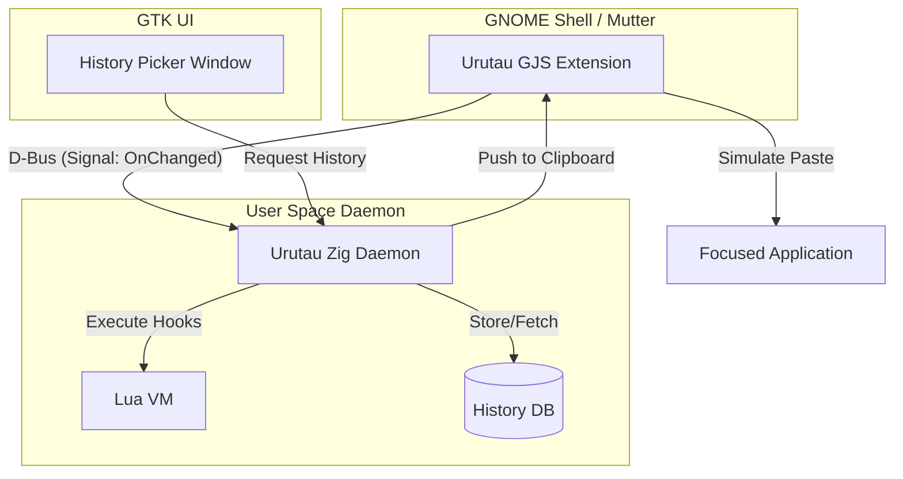
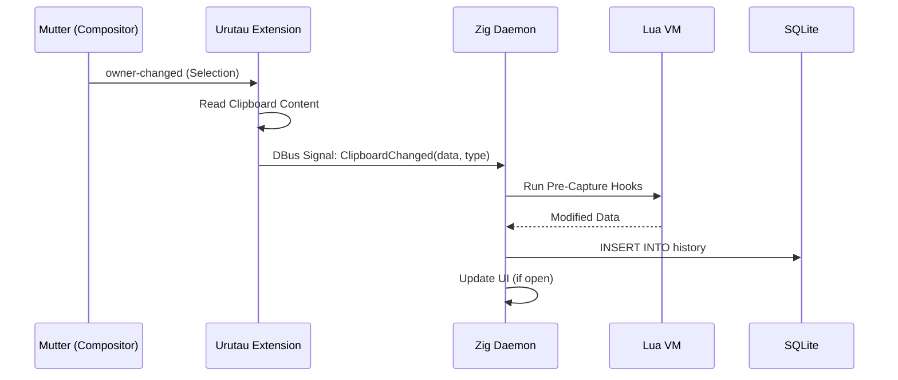

# Design Document - Urutau Clipboard Manager

## Overview
Urutau is a high-performance clipboard manager for Ubuntu 22.04+ (GNOME 42+). It leverages **Zig** for its core engine and **Lua** for user-defined extensibility. The application bridges the security constraints of Wayland by using a hybrid architecture involving a GNOME Shell Extension and a persistent background daemon.

### Goals
- Capture and store text/image clipboard history automatically (1.1, 1.2).
- Provide a fast, searchable UI for history management (2.1, 3.1).
- Enable user-defined transformations via Lua scripts (Requirement 2 logic).
- Ensure seamless integration with GNOME Wayland (5.1, 5.2).

### Non-Goals
- Cross-platform support (Linux/GNOME is the primary focus).
- Synchronizing clipboard across multiple machines (cloud sync).
- Advanced image editing within the app.

## Architecture

### Architecture Pattern & Boundary Map
Urutau follows a **Hybrid Service-Extension** pattern.

**Architecture Integration**:
- **Selected pattern**: Hybrid Extension + Daemon. GJS extension handles privileged Mutter signals; Zig daemon handles data and logic.
- **Domain boundaries**: 
    - **Monitoring**: Owned by the Extension.
    - **Persistence/Logic**: Owned by the Daemon.
    - **Interaction**: Owned by the UI Window.
- **Steering compliance**: Follows Linux desktop standards (XDG paths, D-Bus).

### Technology Stack

| Layer | Choice / Version | Role in Feature | Notes |
|-------|------------------|-----------------|-------|
| Core Engine | Zig 0.15.2 | Daemon & UI logic | Fast, safe, small footprint |
| Scripting | Lua 5.5 | User-defined filters | High extensibility via `ziglua` |
| UI Framework | GTK4 / Libadwaita | History Picker UI | Native Ubuntu look and feel |
| IPC | D-Bus (Session Bus) | Extension <-> Daemon comms | Standard GNOME integration |
| Storage | SQLite 3 | History persistence | Efficient searching and storage |

## System Flows

### Clipboard Capture Flow

## Requirements Traceability

| Requirement | Summary | Components | Interfaces | Flows |
|-------------|---------|------------|------------|-------|
| 1.1, 1.2 | Capture Text/Images | Extension, Daemon | D-Bus (Monitor) | Capture Flow |
| 1.3 | Size Limit | Daemon | Configuration | Logic Gating |
| 2.1 | Display List | UI Picker, Daemon | D-Bus (History) | History Sync |
| 2.2, 2.3 | Delete/Clear | UI Picker, Daemon | D-Bus (Commands) | Deletion Flow |
| 3.1, 3.2 | Search/Filtering | UI Picker, Daemon | SQLite (Full Text Search) | Filter Flow |
| 4.1 | Restore to Clipboard | Daemon, Extension | D-Bus (SetClipboard) | Restoration Flow |
| 4.2 | Auto-Paste | Extension | Mutter Internal API | Paste Simulation |
| 5.3 | Persistence | SQLite | File I/O | Reboot Recovery |

## Components and Interfaces

### [System Layer]

#### Urutau Extension (GJS)
| Field | Detail |
|-------|--------|
| Intent | Bridges GNOME Shell / Mutter to the Zig Daemon |
| Requirements | 1.1, 1.2, 4.1, 4.2, 5.2 |

**Responsibilities & Constraints**
- Monitor `Meta.Selection` for changes.
- Read clipboard data safely.
- Expose D-Bus methods for setting clipboard and simulating paste.

**Contracts**: Service [X] / API [ ] / Event [X] / State [ ]
- **Published Events**: `org.urutau.Monitor.ClipboardChanged(data, mime_type)`
- **Service Interface**: `SetClipboard(data, mime_type)`, `SimulatePaste()`

#### Urutau Daemon (Zig)
| Field | Detail |
|-------|--------|
| Intent | Core engine managing storage, logic, and Lua VM |
| Requirements | 1.3, 1.4, 2.2, 2.3, 5.3 |

**Responsibilities & Constraints**
- Host the Lua VM and execute user hooks.
- Manage the SQLite history database.
- Orchestrate UI window lifecycle.

**Contracts**: Service [X] / API [ ] / Event [X] / State [X]
- **State Model**: `HistoryItem { id, data, type, timestamp, metadata }`
- **Service Interface**: `GetHistory(query, offset, limit)`, `DeleteItem(id)`, `ClearHistory()`

#### History Picker (Zig / GTK4)
| Field | Detail |
|-------|--------|
| Intent | Native UI for searching and selecting history items |
| Requirements | 2.1, 2.4, 3.1, 3.2 |

**Responsibilities & Constraints**
- Render history items using Libadwaita components (`AdwActionRow`).
- Provide real-time search filtering.

**Contracts**: State [X]
- **Implementation Notes**: Uses `GtkFilterListModel` for efficient real-time filtering of the D-Bus backed history list.

## Data Models

### Domain Model
- **ClipboardItem**: Represents a single entry in the history.
    - `id`: UUID / Primary Key
    - `blob`: The actual data (Text or Image bytes)
    - `mime_type`: String (e.g., `text/plain`, `image/png`)
    - `source_app`: Optional app name
    - `timestamp`: UTC DateTime

### Logical Data Model (SQLite)
- **Table `history`**:
    - `id` (INTEGER PRIMARY KEY)
    - `content` (BLOB)
    - `mime_type` (TEXT)
    - `created_at` (DATETIME DEFAULT CURRENT_TIMESTAMP)
    - `search_text` (TEXT) - Stripped text for FTS (Full Text Search).

## Error Handling

### Error Strategy
- **IPC Failure**: If D-Bus connection to Extension is lost, Daemon attempts reconnection with exponential backoff.
- **Storage Failure**: If SQLite is corrupted, rotate to a `.bak` file and notify user.
- **Lua Error**: Catch script errors using `pcall` in the Lua VM; log the error and skip the transformation (graceful degradation).

## Testing Strategy
- **Test quality**: Cover happy paths and edge cases
- **Unit Tests (Zig)**: Test SQLite mapping, Lua VM integration, and data cleaning logic.
- **Integration Tests**: Verify D-Bus message exchange between a mock extension and the daemon.
- **UI Tests**: Manual verification of the History Picker on Ubuntu 22.04 VM.
- **Platform Tests**: Ensure persistence across `reboot`.

## Security Considerations
- **Data Privacy**: Clipboard history is sensitive. Storage must be restricted to `0600` permissions (user-only).
- **Lua Sandboxing**: User scripts run with restricted environment (no `os.execute`, restricted `io`).
- **Wayland Isolation**: The app respects Wayland's security model by going through a privileged Extension bridge rather than bypassing compositor rules.
